# QA Kit

Run the checks a repository owns and get a clear JSON verdict. QA Kit reads a
manifest of repository paths and commands, runs the selected checks, and
records what passed or failed. Tests stay with the code they test.

## How a run becomes a verdict



The manifest chooses the commands; QA Kit records their outcomes. A passing result covers only the checks selected for that run.
[Full-size diagram](assets/readme-flow.svg) · [Editable source](assets/readme-flow.mmd).

## Five-minute public showcase

With Git and Python 3.12 installed, clone the repo and try the disposable
example. The quickstart runs locally without credentials, package installation
or a Legume Labs workspace; it writes only temporary fixtures.

```bash
git clone https://github.com/stevekkall-beansgc/qa-kit.git
cd qa-kit
python3 examples/synthetic_quickstart.py
```

Expected final line:

```text
synthetic quickstart OK (3/3 scenarios, all output in disposable dirs)
```

The example calls the real runner for a passing case, a failed documentation
check and a failed unit test. Each produces a JSON report. Inspect the
[sanitized passing report](examples/synthetic_quickstart_report.json), or
compare it against a fresh run:

```bash
python3 examples/synthetic_quickstart.py --verify-sample examples/synthetic_quickstart_report.json
```

## Use with your own repository

A manifest selects repository paths and setup, unit and optional end-to-end
commands. Only run manifests you trust: their commands execute with your local
permissions.

```bash
python3 bin/run_all.py --all --manifest /path/to/your-manifest.json --logs-dir /path/to/your-reports
```

Reports contain per-check verdicts, durations and captured output. The exit
status distinguishes failed checks from unusable configuration. See the
[detailed runner guide](README-REFERENCE.md#4-understand-the-core-manifest-runner)
for the manifest behavior and report fields.

## Exact limitations

The quickstart tests synthetic documentation and unit paths, not setup,
end-to-end coverage or live fleet health. Raw reports disappear with their
temporary directories; the checked-in sample is a normalized passing result.

The public runtime contract is Ubuntu with Python 3.12. Other Python versions,
implementations and operating systems are not claimed as supported; additional
macOS CI is separate evidence, not a general portability promise.

## Development

```bash
CI=true bash bin/qa_selfcheck.sh
python3 scripts/check_stdlib.py bin/
```

The self-check stays inside this repo. With Task 3 and Python 3.12 on PATH,
`task validate` runs both checks. [CONTRIBUTING.md](CONTRIBUTING.md) covers
setup and sample maintenance; [SECURITY.md](SECURITY.md) covers private reports.

## Legume Labs fleet operations (private workspace)

The default manifest uses private workspace paths. Fleet sweeps, onboarding,
validation enrollment and the binding review-process contract are in the
[fleet operations guide](README-REFERENCE.md#legume-labs-fleet-operations-private-workspace).

### Review-process contract

Fixes still ship a failing-first regression test; new flows need owned unit
and end-to-end checks. The [binding session contract](README-REFERENCE.md#review-process-contract)
still applies. Start from [STANDARDS.md](STANDARDS.md), including the
[README readability standard](README-STANDARD.md) and
[portfolio scorecard](PORTFOLIO-READINESS.md). Structural checks do not replace
a recorded readability review.

Contributor instructions: [AGENTS.md](AGENTS.md).
